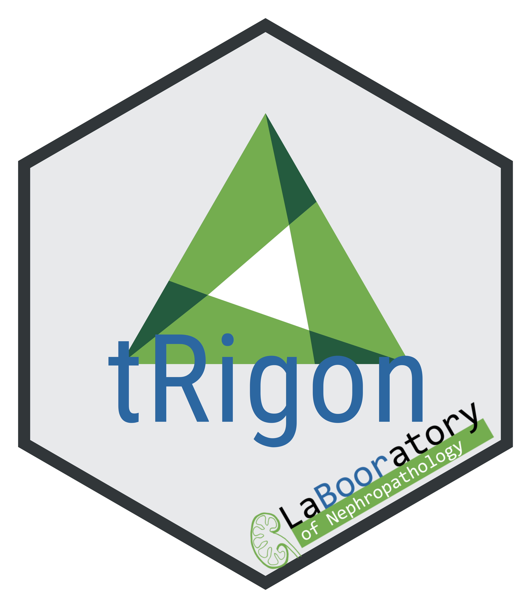

# Contact us &nbsp;

To get in contact with our group, please visit: [<b>LaBOORatory website</b>](https://www.ukaachen.de/kliniken-institute/institut-fuer-pathologie/forschung/labooratory-of-nephropathology/our-interest)

To follow our AI and biostatistics-based projects, please visit: [<b>LaBOORatory GitLab</b>](https://git-ce.rwth-aachen.de/labooratory-ai)

------
# Report bugs

To report bugs and/or request features, please use the following GitLab issue channel: 
  
[<b>https://git-ce.rwth-aachen.de/labooratory-ai/tRigon/-/issues</b>](https://git-ce.rwth-aachen.de/labooratory-ai/trigon/-/issues)

------
# Citation
  
If you find **tRigon** useful, please consider citing our publication:
  
Coming soon :)

------

