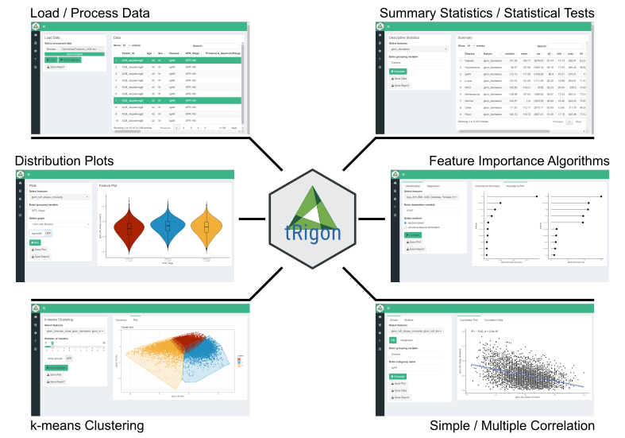

```{r, include = FALSE}
knitr::opts_chunk$set(
  collapse = TRUE,
  comment = "#>"
)
```
Pathomics enables automated, reproducible and precise histopathology analysis and morphological phenotyping. Similar to other molecular omics, pathomics datasets are highly-dimensional and large in size, but also face increased outlier variability and inherent data missingness, making a quick and comprehensible data analysis challenging. 

To facilitate pathomics data analysis and interpretation as well as support a broad implementation for all researchers we developed tRigon (Toolbox foR InteGrative pathOmics aNalysis), a Shiny application built in the R environment for fast, comprehensive and reproducible pathomics analysis. tRigon allows researchers without coding abilities to perform their own exploratory feature analyses.

## Installation

Users  need to have the R environment and optionally RStudio installed. You can download both [here](https://posit.co/download/rstudio-desktop/). 

Next you can run the following code to install tRigon.

```{r eval = FALSE}
install.packages('tRigon')
```

## Usage

Once the tRigon package is installed. You can run the following code to start the web app.

```{r eval = FALSE}
library(tRigon)
tRigon::run_tRigon()
```

## Workflow and Functions

**Figure 1.** Overview of the available tRigon functions with their respective appearance in the user interface (ui).

<br></br>



<br></br>

**Table 1.** tRigon functions with explanations.

| Section      | Function                                                     | Explanation                                                                                                   |
|--------------|--------------------------------------------------------------|---------------------------------------------------------------------------------------------------------------| 
| **Data** |                                                              |                                                                                                               |
|              | Processing data                                             | tRigon can process .csv files of pathomics data together with provided experiment / clinical data meta files. tRigon aggregates pathomics files and assigns them to the provided labels from the metadata. Users can choose between processing human or animal experiment data with calculations on specimen or single-structure level. |                                                                            
|              | Loading data                                                 | tRigon can also be used to load other data (e.g., other omics datasets) or already processed pathomics files. |                                                                  
| **Statistics** |                                                            |                                                                                                               |                                                                                                                                                  
|              | Descriptive statistics                                       | Based on a provided group label tRigon can calculate summary statistics (e.g., mean, median, standard deviation, interquartile range) for each chosen feature. |                                                                                                                                                                                                                                                                                       
|              | Statistical tests                                             | tRigon supports a range of non-parametric statistical tests such as:<br />(1) pairwise Wilcoxon-rank tests with Bonferroni correction for multiple testing<br />(2) Kruskal-Wallis tests<br />(3) differences in median with bootstrapped confidence intervals for each desired feature and provided group label. |                                                                                                 
|              | Correlation                                                    | Simple and multiple correlations based on the Pearson-correlation coefficient can be calculated and visualized as a scatter plot or correlation matrix for each chosen feature. Users can also specify a group and subgroup for specific correlation analysis. |
|              | Machine learning                                              | For calculation of feature importance tRigon supports random forests and recursive feature elimination (RFE) for classification and regression of chosen features based on a selected dependent variable. For RFE users can also specify the number of folds for cross-validation as well as repeats. |
|   **Plots** |                                                             |                                                                                                          |                                                                                                                                         
|                | Distribution plots                                          | Based on a provided group label tRigon plots selected feature distributions in a variety of plots:<br />(1) violin plots<br />(2) box plots<br />(3) ridgeline plots |      
|                | Clustering                                                  | tRigon supports k-means clustering for selected variables. Groups can also be plotted within a separate legend. | 
| **Data** |                                                              |                                                                                                               |
|                 | Markdown reports                                                  | For each function tRigon users can download a markdown report in .html format including all relevant inputs and outputs of the application. |                                                                      
## Data Preparation

tRigon supports .xlsx and .csv formats as data inputs for processing pathomics files or loading own datasets.

**Note that**: For processing pathomics files users need the raw data including a meta data file in .xlsx format containing additional information. For human and/or animal experiment data there are different conditions on how the meta data has to be organized. These can be found in the **Help** section of the application.

## Demo Data

FLASH-generated pathomics demo files for five human and mouse datasets as well as three non-pathomics medical datasets have been provided. Please use this [link to access](https://git-ce.rwth-aachen.de/labooratory-ai/flash/-/blob/main/NGM_DataRepository.zip) the demo data.

## Citation

If you find this shiny application useful, please consider citing the corresponding publication:

- [David L. Hölscher, Michael Goedertier, Barbara M. Klinkhammer, Patrick Droste, Ivan G. Costa, Peter Boor, Roman D. Bülow]

## Further Information

Further information on how to use tRigon for analysis and data processing are provided in the **Help** section of the application.

Information regarding **FLASH (framework for large-scale histomorphometry)** can be found [here](https://www.nature.com/articles/s41467-023-36173-0)
